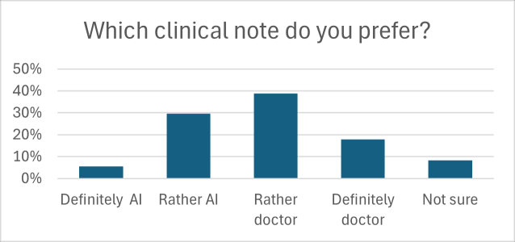
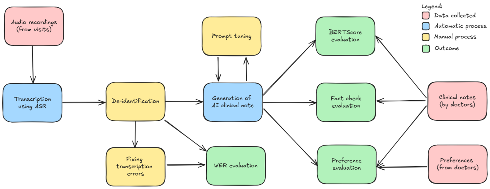
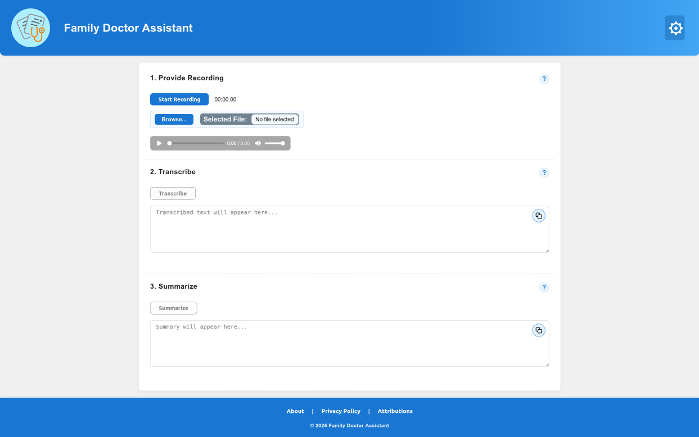

# Family doctor assistant based on automatic speech recognition and large language models

## Summary

| Company Name                          | [Medisoft AS](https://medisoft.ee/)          |
| :------------------------------------ | :------------------- |
| Development Team Lead Name            | Tambet Matiisen      |
| Development Team Lead E-mail          | tambet.matiisen@ut.ee |
| Duration of the Demonstration Project | 1.09.2024 - 31.05.2025   |
| Final Report                          | [Family_doctor_assistant.docx](report/Family_doctor_assistant.docx) |

# Description

## Objectives of the Demonstration Project

The average duration of a family doctor's appointment in Estonia is 14 minutes. At the end of the visit, the doctor prepares a written summary of the patient's primary complaint, the physical examination, and a further treatment plan, which is based on the doctor-patient conversation. It is estimated that approximately a third of the doctor's time is spent taking the patient's history and documenting the visit \[1]. This equates up to about three hours of documentation daily.

Based on the promising results of a prior project conducted at the University of Tartu (UT) we wanted to evaluate the potential of automatic speech recognition (ASR) and large language models (LLM) in creating summaries of family doctor appointments. We aimed to compare the quality of LLM-generated clinical notes using both automated metrics and physician preferences.

\[1] Metsallik, A. (2020). “Using the time and motion study method to investigate Estonian family physicians’ time utilization during face-to-face patient visits”. \[Master's thesis]. [https://digikogu.taltech.ee/en/Item/3c2b5f25-d25b-4f61-b03a-dee96474702d?\_ga=2.2176](https://digikogu.taltech.ee/en/Item/3c2b5f25-d25b-4f61-b03a-dee96474702d?_ga=2.2176)

## Activities and Results of the Demonstration Project

### Challenge

We aimed to reduce the proportion of time doctors spend writing clinical notes. From the physician’s perspective, tasks such as taking the patient’s history, performing the physical examination, and formulating a treatment plan do not take the most time. Instead, documentation consumes the majority of the clinical encounter \[1–4]. Clinical notes typically follow a rigid structure, use domain-specific terminology, and are written concisely. Their primary purpose is to communicate information to other healthcare providers and, increasingly, to patients. They also serve as a legal record of care. Automating the creation of clinical notes could significantly reduce the documentation burden. This freed time could be used to enhance patient communication or to shorten visit durations, allowing physicians to see more patients. Creation of clinical notes was the initial challenge, which did not change throughout the project period.

**References**

\[1] Männil, A. (2020). “Using the time and motion study method to investigate Estonian family physicians’ time utilization during face-to-face patient visits” (,,Aja ja tegevuste vaatlusuuringu meetodi kasutamine Eesti perearstide ajakasutuse ja erinevate tööprotsesside ajalise jaotuse uurimiseks patsiendi visiitidel”). \[Master's thesis]. [https://digikogu.taltech.ee/en/Item/3c2b5f25-d25b-4f61-b03a-dee96474702d?\_ga=2.2176](https://digikogu.taltech.ee/en/Item/3c2b5f25-d25b-4f61-b03a-dee96474702d?_ga=2.2176)

\[2] Sinsky, C., Colligan, L., Li, L., Prgomet, M., Reynolds, S., Goeders, L., Westbrook, J., Tutty, M., & Blike, G. (2016). Allocation of physician time in ambulatory practice: A Time and motion study in 4 specialties. *Annals of Internal Medicine,* 165(11), 753. [https://doi.org/10.7326/m16-0961](https://doi.org/10.7326/m16-0961)

\[3] Arndt, B. G., Beasley, J. W., Watkinson, M. D., Temte, J. L., Tuan, W\.-J., Sinsky, C. A., & Gilchrist, V. J. (2017). Tethered to the EHR: Primary care physician workload assessment using EHR event log data and time-motion observations. *The Annals of Family Medicine,* 15(5), 419–426. [https://doi.org/10.1370/afm.2121](https://doi.org/10.1370/afm.2121)

\[4] Ehrenfeld, J. M., & Wanderer, J. P. (2018). Technology as friend or foe? Do electronic health records increase burnout? *Current Opinion in Anaesthesiology,* 31(3), 357–360. [https://doi.org/10.1097/aco.0000000000000588](https://doi.org/10.1097/aco.0000000000000588)

### Activities implemented and results achieved&#x20;

Before starting the project, we obtained approval from the University of Tartu Ethics Committee. Then we recruited 10 family physicians or residents to participate. Each participant received a password-protected voice recorder and was instructed to record 10 consultations with different Estonian-speaking adult patients. In total, we collected 98 appointment recordings along with the corresponding summary notes written by the doctors.

All recordings were transcribed using the **Est-ASR** pipeline developed by the **TalTechNLP** group \[1]. We also evaluated **OpenAI’s Whisper** fine-tuned for the Estonian language \[2], but its performance on Estonian-language audio was sub-optimal. The average word error rate (WER) for the Est-ASR pipeline was 0.12 (standard deviation \[SD] 0.08), compared to 0.31 (SD 0.11) for Whisper.

All transcripts were manually reviewed by the development team to remove personally identifiable information (excluding health data). These transcripts served as input for generating summaries. Additionally, the transcription errors in the texts were corrected and these corrected transcripts were used as reference texts for calculating the WER above.

An informal benchmark was conducted to evaluate the performance of state-of-the-art large language models (**GPT-4o, Claude 3.5, LLaMA 3**) on Estonian-language clinical data \[3–5]. GPT-4o consistently outperformed the other models in grammatical correctness and fluency in Estonian. Based on these results, GPT-4o was selected for generating clinical notes. Notably, we found that English-language prompts consistently outperformed those in Estonian in terms of factual accuracy and summary coherence. As a result, the final implementation used an English-language prompt for all summary generation tasks.

The generated summaries were evaluated against doctor-written summaries using three methods:

* **BERTScore** to compare (word-level) semantic similarity of AI-generated and doctor-written summaries.
* **Automated fact check** using reasoning models to validate factual correctness of AI-generated summaries.
* **Expert review** by participating doctors to evaluate subjective preference between AI-generated and doctor-written summaries.

To evaluate doctors’ subjective preferences, we created a survey using **LimeSurvey**. Participating doctors were shown up to 80 randomly ordered summary pairs (one generated by AI, the other written by a fellow doctor). For each pair, doctors were asked to assess:

* Which summary they preferred on a 5-point Likert scale (1 – Definitely A, 2 – Rather A, 3 – Not sure, 4 – Rather B, 5 – Definitely B), **and**
* Which summary they believed was AI-generated (1 – Definitely A, 2 – Rather A, 3 – Not sure, 4 – Rather B, 5 – Definitely B).

The purpose of the survey was to evaluate whether AI-generated summaries were distinguishable from human-written ones and to assess their clinical acceptability.

**References**

\[1] Olev, A., & Alumäe, T. (2022). *Estonian speech recognition and transcription editing service.* Baltic Journal of Modern Computing, 10(3). [https://doi.org/10.22364/bjmc.2022.10.3.14](https://doi.org/10.22364/bjmc.2022.10.3.14)

\[2] TalTechNLP. (2023). [https://huggingface.co/TalTechNLP/whisper-medium-et](https://huggingface.co/TalTechNLP/whisper-medium-et)

### Data Sources

All participating doctors were provided with password-protected voice recorders to capture 10 real-world primary care appointments per doctor. The resulting audio recordings served as the core dataset for this project. Transcription of the recordings was performed using the Est-ASR pipeline developed by the TalTechNLP group \[1]. These transcriptions were then processed with GPT-4o \[2], which generated structured clinical summaries.

In parallel, we collected the original clinical notes written by the doctors for the same visits. This enabled a one-to-one pairing between human-written and LLM-generated summaries.

To assess the quality and acceptability of the AI-generated content, we constructed a comparative survey using LimeSurvey. Participating doctors were invited to evaluate the summaries, allowing for structured feedback based on real clinical content.

**References**

\[1] Olev, A., & Alumäe, T. (2022). Estonian speech recognition and transcription editing service. *Baltic Journal of Modern Computing,* 10(3). [https://doi.org/10.22364/bjmc.2022.10.3.14](https://doi.org/10.22364/bjmc.2022.10.3.14)

\[2] Hurst, Aaron, et al. “Gpt-4o system card.” *arXiv* (2024). [https://arxiv.org/abs/2410.21276](https://arxiv.org/abs/2410.21276)

### AI Technologies

Large language models (LLMs) have demonstrated strong performance in summarization tasks. However, their effectiveness for processing medical data in Estonian was unknown. As outlined in the “Activities Implemented and Results Achieved” section, we systematically tested several automatic speech recognition (ASR) pipelines and LLMs for transcription and summarization, respectively. Ultimately, we selected the Est-ASR pipeline \[1] for transcription and GPT-4o \[2] for generating appointment summaries.

Given the absence of an established gold standard for evaluating AI-generated medical text, we developed a multi-step evaluation framework to identify the most suitable prompt for summary generation. In total, we tested five different prompt variants. We began with a general-purpose clinical summarization prompt and refined it iteratively based on trial-and-error. One of the tested prompts was based on an excerpt from a clinical textbook \[3], intended to anchor the output in medically accurate language and structure.

To compare the prompts, we used a combination of evaluation methods:

* Quantitative NLP metrics, including BERTScore to assess semantic similarity with human-written notes;
* Automated fact-checking, using a separate reasoning model to extract and compare clinical facts from both AI- and human-generated summaries;
* Expert review, involving subjective assessment by a licensed medical professional on clarity and clinical soundness.

The final prompt was selected based on the combination of BERTScore, fact checking and subjective assessment.

**References**

\[1] Olev, A., & Alumäe, T. (2022). Estonian speech recognition and transcription editing service. *Baltic Journal of Modern Computing,* 10(3). [https://doi.org/10.22364/bjmc.2022.10.3.14](https://doi.org/10.22364/bjmc.2022.10.3.14)

\[2] Hurst, Aaron, et al. “Gpt-4o system card.” *arXiv* (2024). [https://arxiv.org/abs/2410.21276](https://arxiv.org/abs/2410.21276)

\[3] Hunskår, S. & Kalda, R. (Eds.). *Peremeditsiin.* Eesti oludele kohandatud norrakeelsest õpikust *Allmennmedisin.* Tartu: University of Tartu Press, 2020. 1004 lk. ISBN 978-9949-03-436-9.

### Technological Results

#### Diversity and Representativeness of the Recordings

The recordings collected from participating family physicians covered a wide spectrum of health issues — from general health check-ups to acute illnesses, chronic disease management, and mental health conditions. This breadth allowed us to test the technology in a highly realistic setting that mirrors the daily challenges faced in primary care.

In addition to the range of medical topics, we also ensured diversity in the clinical environments. Namely, the physicians were recruited from multiple locations across Estonia, including urban family health centers in major cities and one rural setting. This variety helped us capture not only different styles of medical communication but also different logistical settings, patient profiles, and types of medical cases.

#### Accuracy of Speech Recognition

The automatic speech recognition (ASR) system developed by TalTechNLP performed well in technical terms. Across all recordings, the average word error rate (WER) was 0.12. This indicates that the system is generally capable of transcribing Estonian-language clinical conversations, even when they include informal phrasing, abbreviations, and medical jargon.

However, our manual review revealed that transcription errors were not evenly distributed. Most of the mistakes occurred in the most clinically important areas — medication names, anatomical terms, diagnoses, physical examination findings, and key contextual elements such as symptoms or environmental exposures (e.g., “tick bite”).

While the overall error rate appears low, the clinical significance of the errors is disproportionately high. Importantly, we did not systematically assess whether these transcription mistakes resulted in factual errors in the generated summaries or clinical notes. However, based on qualitative review, transcription quality — particularly around medical vocabulary — remains a critical bottleneck for safe and reliable automation in clinical documentation workflows.

#### Semantic Similarity Between AI and Doctor Summaries

To evaluate how closely the AI-generated summaries matched those written by physicians, we calculated the BERTScore, a widely used natural language processing metric that measures semantic similarity between two texts. Specifically, we used the F1 component of the BERTScore, which balances precision and recall at the word embedding level.

For each clinical encounter, we generated ten summaries to evaluate the variability of outputs, captured by the standard deviation. We performed this evaluation on two types of input: summaries generated from the original ASR transcripts, and those generated from manually corrected transcripts.

BERTScores ranged from 0.640 to 0.666 for summaries based on original transcripts, and from 0.643 to 0.671 for those based on corrected transcripts. This comparison reveals several points. First, the narrow range of values suggests that prompt changes had only minor effects on semantic similarity, or that such differences are not well captured by BERTScore. Second, the non-zero standard deviation confirms that output variability persisted despite attempts to enforce deterministic summary generation. Third, the slightly higher scores for corrected transcripts indicate that while transcription quality has some impact, the LLM was able to partially compensate for the ASR errors.

Overall, these findings suggest that while BERTScore can quantify general semantic alignment, it is not sufficiently sensitive to detect meaningful differences between prompts or input quality.

**Table 1. Average BERTScore Results Comparing AI-Generated and Doctor-Written Clinical Notes**
“BERTScore" refers to summaries generated from the original ASR transcript; "BERTScore (clean)" refers to summaries generated after transcript correction.

| Prompt   | BERTScore | Standard deviation | BERTScore (clean) |
| :------- | :-------- | :----------------- | :---------------- |
| Prompt 1 | 0.640     | 0.004              | 0.643             |
| Prompt 2 | 0.658     | 0.005              | 0.661             |
| Prompt 3 | 0.644     | 0.005              | 0.650             |
| Prompt 4 | 0.666     | 0.006              | 0.671             |
| Prompt 5 | 0.661     | 0.004              | 0.664             |

#### Factual Overlap Between AI and Doctor Summaries

Beyond semantic similarity, we assessed factual accuracy more directly by comparing the content of AI-generated summaries with those written by physicians. We calculated three standard metrics:

* **Precision:** The proportion of facts in the AI summary that were also present in the physician’s summary;
* **Recall:** The proportion of facts from the physician’s summary that were captured by the AI;
* **F1-score:** The harmonic mean of precision and recall, summarizing overall factual alignment.

Precision scores ranged from 0.534 to 0.540, while recall ranged from 0.457 to 0.504, resulting in F1-scores between 0.482 and 0.512. These figures indicate a substantial gap in factual overlap: approximately half of the information in AI summaries was either missing or not aligned with the physician’s documentation.

However, subjective evaluation did not always support the conclusion that 50 % of the content was wrong or irrelevant. In the qualitative review, the summaries did not appear dramatically deficient. This suggests that not all facts carry equal weight — and missing or mismatched information may be less critical in some contexts. Certain “core facts” are essential in a clinical summary, while others are optional or context-dependent. Future work should focus on developing improved evaluation methods that account for the importance and priority of specific facts in clinical documentation.

**Table 2. Fact-check Results Between Clinical Notes Generated by AI and Written by Doctors**

| Prompt   | Precision | Recall | F1-score |
| :------- | :-------- | :----- | :------- |
| Prompt 1 | 0.537     | 0.457  | 0.482    |
| Prompt 2 | 0.538     | 0.485  | 0.499    |
| Prompt 3 | 0.540     | 0.504  | 0.512    |
| Prompt 4 | 0.534     | 0.484  | 0.498    |
| Prompt 5 | 0.538     | 0.494  | 0.505    |

#### Preferences of Participating Physicians

To evaluate clinicians' perceptions of the generated summaries’ quality, we conducted a preference test. Physicians were shown pairs of clinical summaries — one written by another participating doctor (not by themselves) and one generated by the AI model — and asked to indicate which they preferred using a 5-point Likert scale. The summaries generated with prompt 4 were chosen based on the quantitative results and the subjective preference of a medical expert in the development team.

The results were as follows:

* 56.5 % of cases physicians preferred the human-written summary (17.8 % "definitely" and 38.8 % "rather");
* 35.2 % of cases they preferred the AI-generated summary (5.6 % “definitely”, 29.6 % “rather”);
* 8.3 % of cases expressed no clear preference between the two.

These findings show that while physicians still favor human-written documentation overall, 43.5 % of AI-generated summaries were judged to be of comparable or better quality.

During the project, we also gathered sufficient feedback to identify concrete ways to refine the AI prompt to better align with physicians' expectations and writing style. Furthermore, we anticipate that as clinicians adapt to voice-based workflows, they may begin to speak in ways that naturally include key information — ensuring that these elements are captured in the audio and subsequently reflected in the AI-generated summaries. This mutual adaptation between technology and clinical practice is likely to improve documentation quality in future iterations.

**Figure 1** Physicians’ Preferences for Clinical Summaries: AI-Generated vs Doctor-Written

#### Ability to Distinguish AI-Generated Content

We also asked physicians to identify which of the two summaries had been generated by the AI. In 97.8 % of cases, they correctly identified the AI-generated summary. However, due to a technical issue, the summaries were not properly blinded: the doctor-written summary always appeared on the left, and the AI-generated summary on the right. While this compromises the internal validity of the test and the result should therefore be interpreted with caution, we believe the strong recognition rate reflects more than just positional bias.

This finding underscores the distinctive and recognizable style of AI-generated summaries — typically more structured, verbose, and formally worded compared to the concise and pragmatic tone characteristic of clinician documentation.

#### Summary-Level Preference for LLM-Generated Notes

To evaluate performance beyond overall percentages, we analyzed preferences at the level of individual summary pairs by aggregating responses across all participating physicians. For each pair of summaries (one written by a doctor, one generated by the LLM), we calculated whether the AI-generated version was preferred or rated as equal by at least 50 % of respondents. Based on this threshold, 35.2 % of summary pairs were classified as cases where the LLM output was perceived as comparable or superior to the physician-written note.

This result is important because it reflects a consensus-based evaluation that mitigates individual bias. Rather than counting all ratings equally across the dataset, this approach highlights the proportion of summary tasks where the AI system produced an output that met or exceeded the expectations of most clinicians. It signals that in more than one-third of clinical cases, current-generation LLMs can produce summaries that a majority of doctors find acceptable or even preferable.

Due to time limitations, we did not investigate the reasons behind these preferences—whether the LLM summaries were particularly well-aligned with clinical expectations, or whether the original doctor-written summaries lacked clarity or completeness. However, this approach offers a relatively objective view of how often LLM outputs can meet or exceed clinical expectations and establishes a foundation for future work aimed at understanding what constitutes a high-quality clinical summary.

#### Summary of Qualitative Feedback

We collected written feedback from participating doctors. A synthesis of the comments reveals the following key points:

**Strengths of AI-generated summaries**

* Clearer structure, often using numbered lists;
* Good general readability, especially for non-specialist audiences;
* Occasionally identified relevant issues not mentioned by the doctor;
* May assist physicians who struggle with documentation or time constraints.

**Weaknesses of AI-generated summaries**

* Frequent factual inaccuracies, especially in drug names, lab results, dates, and age;
* Inclusion of unnecessary details or irrelevant information (“digital clutter”);
* Generalizations and lack of specificity in physical exam findings;
* Does not incorporate prior knowledge or unspoken clinical reasoning;
* Risk of introducing misleading information due to shallow understanding of context.

Physicians generally agreed that AI summaries might be helpful as drafts — particularly for structuring or documenting repetitive or routine elements — but always require critical review and correction by a trained clinician.

#### Conclusion

The combined use of Estonian-language speech recognition and large language model–based summarization shows clear potential but remains limited by critical weaknesses. While transcription accuracy was generally good, clinically important errors persist in medication names, diagnoses, and physical findings. Semantic and factual similarity between AI and physician summaries was moderate, with roughly half of the relevant facts missed or misrepresented. Yet in nearly one-third of the cases, physicians preferred the AI-generated summaries, highlighting their strength in structure and readability. However, the AI-generated summaries consistently lacked nuanced clinical reasoning and contextual knowledge.

These results indicate that the current system can serve as a foundation for an assistive tool. With targeted improvements to medical transcription accuracy, prompt design based on clinical priority rather than word-level similarity, and integration into physician-led workflows, this technology could meaningfully reduce the doctors’ documentation burden without compromising the quality of the clinical notes.

### Technical Architecture

**Figure 2** NLP-Based Clinical Documentation Pipeline

### User Interface

A basic web application was developed that allows users to upload an audio file, which can be then transcribed and summarized. The application also supports live audio capture directly through the browser interface. The resulting transcription and summary can be easily modified and copied to an external application.

The prototype can be accessed from [https://perearstiai.github.io/](https://perearstiai.github.io/). OpenAI API key is necessary to make use of the transcription and summarization functionality. Please note that the application sends data to OpenAI for processing and therefore does not satisfy the data privacy requirements for actual use, it can be only used for demonstrations.

**Figure 3** Prototype application user interface.

While the current interface is a standalone web-based application, it could also be integrated into existing electronic health record (EHR) to better align with clinical workflows. This integration would improve usability and reduce duplication of effort for healthcare professionals.

Importantly, the system was not validated as part of a clinical workflow or tested in real-time clinical decision-making. Instead, it served as an experimental interface for assessing the technical feasibility of ASR and LLM-based summarization. Also, the privacy and legal aspects of using AI to process medical conversations between patient and doctor were not assessed in this project.

A key improvement area for future development is incorporating access to the patient’s previous medical history into the summarization process. Including this information could improve the contextual accuracy and clinical relevance of generated summaries, particularly for chronic disease management and continuity of care.

However, based on our evaluation, the AI-generated summaries still require human review before use in practice. Current models are prone to hallucinations and may omit clinically relevant information or include non-essential details. While model improvement is expected, human oversight remains essential at this stage.

### Future Potential of the Technical Solution

This project demonstrated that AI solutions — specifically automatic speech recognition (ASR) and large language models (LLMs) — have strong potential for automating clinical note-taking during medical appointments. Although this study focused on family physicians, the same approach could be extended to other healthcare professionals, such as nurses, physiotherapists, and clinical psychologists, as well as to physicians in other specialties (e.g., endocrinology, rheumatology) conducting consultations in Estonian.

While the current evaluation was limited to an outpatient setting, the solution may also be applicable in inpatient care. However, its performance in that context should be validated before deployment.

Beyond clinical care, this type of summarization tool could be useful in other domains that rely on structured summaries of spoken content — such as social work, legal depositions, or research data collection.

Overall, AI-based documentation tools could substantially reduce the time and administrative burden on professionals. However, human oversight remains essential, as current models may hallucinate, omit critical information, or include irrelevant details.

We plan to publish the results of this project, as they hold relevance not only for Estonian-language applications but also for the broader global community working on AI-assisted clinical documentation.

As this was a demonstration project, there is substantial room for further development across multiple dimensions:

* **Real-Time Summary Generation** – enable real-time generation of finalized summaries by the end of the consultation.
* **System Integration and Personalization** – integrate with existing EMR systems and comply with local legal frameworks.
* **Expanded Testing Across Clinical Scenarios** – include pediatric consultations, multilingual encounters, and multi-speaker dialogues.
* **Phone Consultations** – evaluate performance in audio-only interactions.
* **Custom Output by Visit Type** – adapt structure and content to the type of visit.
* **Bias and Equity Audits** – audit for differential performance across patient subgroups.
* **Commercialization Considerations** – differentiate through local adaptation, clinical relevance, and EMR compatibility.

### Lessons Learned

This project provided a practical evaluation of whether AI-based tools — namely ASR and LLMs — can reduce the time doctors spend documenting patient encounters. The following lessons emerged:

* **Limited Capture of Physical Examination Findings** – unless physicians explicitly verbalize physical exam findings, these are not captured by the ASR system.
* **Inaccurate Transcription of Medication Names** – ASR systems frequently misinterpret drug names.
* **Lack of Context from Medical History** – current LLMs lack access to longitudinal medical history, leading to summaries that omit relevant context.
* **Mumbled Responses Are Not Captured** – ASR systems often fail to register low-volume or mumbled utterances.
* **Inadequate Microphone Placement Degrades Accuracy** – optimal microphone placement is essential.
* **Ambiguity in Summary Quality Standards** – no universally accepted definition of a "good" clinical summary; existing NLP metrics poorly reflect clinical quality.
* **Positive Reception Among Participating Doctors** – physicians recognized the potential value of the technology.
* **Need for Personalization to Mimic Clinician-Specific Documentation Styles** – output should reflect structure, phrasing, and emphasis used by individual physicians.

In summary, while the solution shows promise, AI-generated summaries currently require human revision to ensure clinical safety and accuracy. Although we did not formally measure time savings in this project, the pipeline generates a draft clinical note in approximately one minute, suggesting that meaningful time savings may be achievable. With further model refinement and workflow integration, this could allow physicians to delegate much of the documentation burden to AI. Additionally, as open-source models continue to improve — potentially within the next year — the reliability and applicability of this technology are likely to increase, enabling broader, safer, and more autonomous use in clinical settings.

